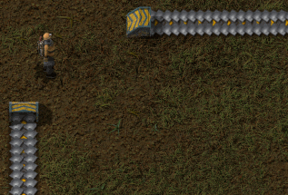
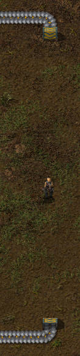
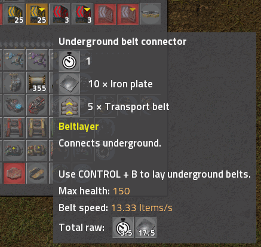
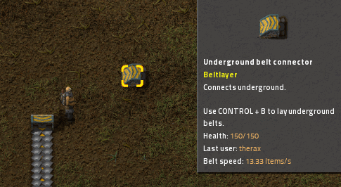
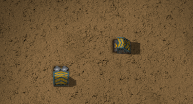
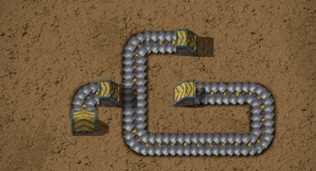

# Description

Ever wanted your underground belts to turn corners?

Ever wanted to run underground belts long distances without periodically popping up above ground?

Ever wondered why underground belts cost the same whether you run them under one tile or their full length?

If the answer to any of these questions is yes, then you need Beltlayer.

# How to use

1. Build some Beltlayer connectors of the desired belt speed. Connectors are researched at the same time as the normal underground belts of the same speed and use the same recipe.

    

1. Place down two connectors, one at the entrance and one at the exit. You can use any rotation for these connectors. Change the connectors between input and output mode with the rotation key (normally R).

    

1. As the description for the connector indicates, press CONTROL+B (rebindable) to show the editor interface. You will see the underground endpoints of the two connectors you placed. The editor interface carries over all passive belt entities (belts and normal underground belts; no splitters or loaders) that were in your inventory.

    

1. Place belts in the glorious freedom of the underground between the two connectors, using the belt mechanics you are already familiar with.

    

1. Press CONTROL + B again to return to your character in the overworld.
1. Profit!

    

# Caveats

1. Connectors can only be placed on the main overworld map. No, you can't use these in space, Factorissimo buildings, or any other custom surfaces that may be added by other mods.

1. Blueprinting and deconstruction is implemented with Black Magic. There are almost certainly bugs. There are also a huge variety of possible scenarios in which you might encounter problems. Please report *exactly* what you did leading up to a bug, including:
    1. a screenshot showing the precise area selected with the blueprint or deconstruction tool,
    1. a screenshot of the below ground editor matching the above ground screenshot,
    1. the filter settings of the deconstruction tool, if applicable,
    1. a screenshot of the blueprint setup window, if applicable, and
    1. a description of what you expected to happen, and what happened instead.

# Comparison to similar mods

## [Subterrain](https://mods.factorio.com/mod/Subterrain)

* Beltlayer belts can turn corners.
* Beltlayer belts are blueprintable and can be built with construction robots.

## [Subterra](https://mods.factorio.com/mod/subterra)

* Subterra allows players and fluids to be transferred through the ground, as well as items.
* Subterra allows complete subterranean bases including assemblers, refineries, etc.
* Beltlayer is substantially more UPS-efficient.
* Beltlayer belts are blueprintable and can be built with construction robots.

# FAQ

## What's with the name of the mod?

A pipelayer is a person who installs ("lays down") pipes in underground areas. It is also a reference to the separate underground layer where the belts are routed.

## Isn't this a little bit cheaty?

Yes, it absolutely is! The straight-line and length limitations of standard underground belts are part of Factorio's design challenge. Overuse of this mod may result in an unintended shortage of spaghetti in your factory.

On the other hand, you still have to move items on the surface to connects belts to circuits and route items into and out of assembling machines, so the potentional for abuse is somewhat limited. Using this mod also introduces a new layer of complexity, where keeping track of where items are routed is no longer obvious just from looking at the surface. If you're not careful, you can make your own factory layout very confusing to navigate.